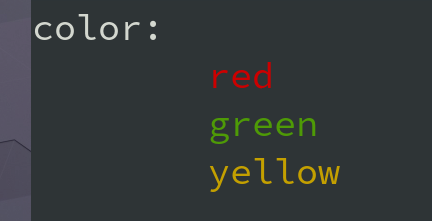

# Playground
Notes in code<br>
[golang is the primary directory](https://github.com/XanthusL/Playground/tree/master/golang)


> Good good study<br>Day day up

## Rust

### colored text

```rust
 mod color;
 use color::Dye;

 fn main(){
     let red = color::color("red".to_string(),color::RED);
     println!("color:\n\t{}\n\t{}\n\t{}\n",red,"green".green(),"yellow".color(color::YELLOW));
 }

```

